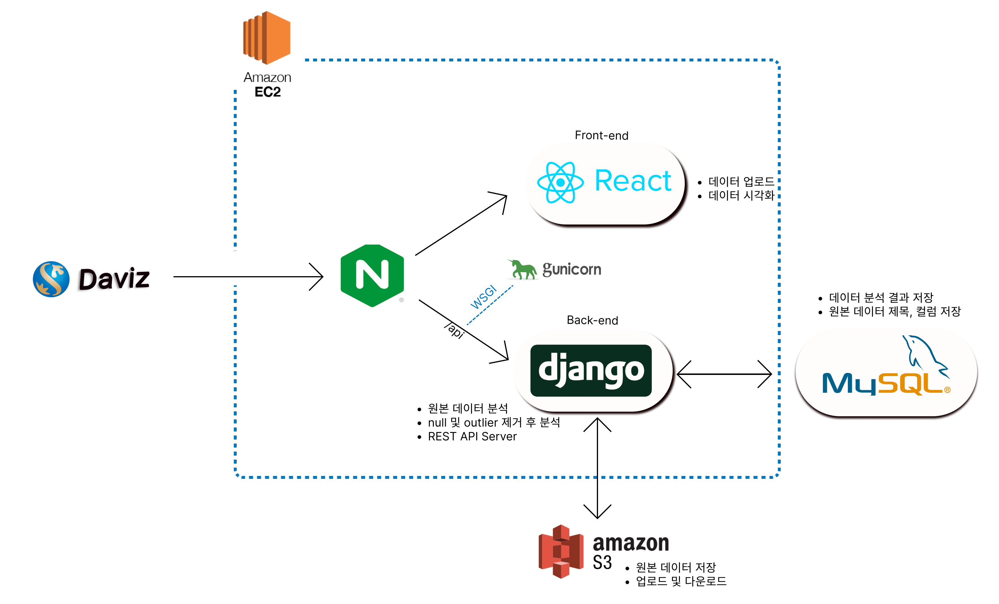
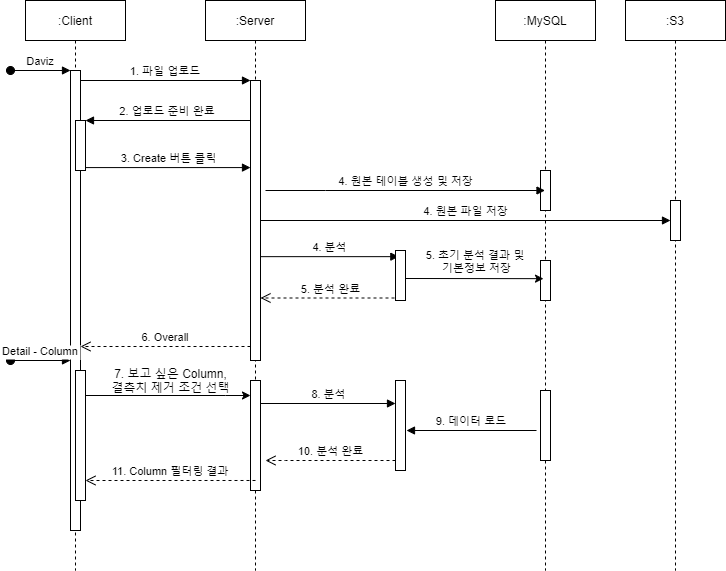

# DaViz (데이비즈):cookie:

> 프로젝트명 : DaViz (Data + Visualization) 
>
> 배포 주소 :  https://daviz.shop/


## 목차📚

- [프로젝트 소개](#1.-프로젝트-소개)

- [기획 의도](#2.-기획-의도)
- [서비스 소개](#3.-서비스-소개)
- [개발 스택](#4.-개발-스택)
- [서비스 구조](#5.-서비스-구조)
- [팀원 소개](#6.-팀원-소개)
- [후기](#7.-후기)


## 1. 프로젝트 소개

> 삼성 청년 SW 아카데미 2학기 최종 프로젝트 (기업연계)

### 1) 명세 기반 프로젝트

- 고객사에서 명세를 받아 요구사항을 분석하고 이를 만족할 수 있는 서비스 기획 및 구현
- 요구 사항 분석
  - Client : 신한은행 내 데이터 분석가 (ML / DL)
  - 주요 내용 
    - 은행 외부 데이터 분석 및 활용의 증가
    - 데이터 분석에 앞서 데이터셋에 대해 1차 전처리 및 기본 분석 진행
    - 해당 데이터셋의 **feature** 추출
    - Column 별 기본 통계치와 Null, **이상치 확인 및 제어** 가능
    - 분석 내용 **시각화**


### 2) 기업 연계 프로젝트

- 대상 : 신한은행 (ICT사업부)
- 멘토
  - 신한은행 ICT 사업부 현업 개발자 
  - 오주용 선임
  - 안효민 선임
- 진행 
  - 주 2회 멘토 미팅을 통해 진행 상황 및 프로젝트 방향 점검
  - 피드백 내용 수정 및 개선

- 개발 기간 
  - 10.13 ~ 11.19 (6주)


### 3) 산출물

- [README](#DaViz-(데이비즈):cookie:)
- [포팅메뉴얼](./.exec)
- [기획 및 설계 자료](./설계)
- 최종 발표안


## 2. 기획 의도

> 명세 기반의 프로젝트이나 해당 서비스는 신한은행에 한정되지 않고 개발자, 데이터 분석가 등 데이터 분석을 진행하는 모든 유저로 확대 될 수 있음.  따라서 범용성이 높은 서비스를 기획, 구현하였다.

### 1) 배경

- 산업 전반에 걸친 데이터 활용 사례 및 중요성 증대

  - 정보의 홍수, 현대 사회는 정보의 양과 접근성이 크게 늘어났고 이는 비즈니스 성공의 열쇠가 된다.
  - 따라서 모든 산업과 기업들은 데이터를 활용할 수 있는 방안을 강구하고 **빅데이터**와 **AI**를 적극 활용한다.
  - 때문에 다양한 분야에서 데이터를 수집, 분석하는 업무는 모든 비즈니스에서 필수가 되었다. 

  

- 데이터 분석, 활용의 어려움
  - 데이터 분석의 첫번째 작업은 **데이터셋의 특성을 파악**하는 것
  - 이는 전문성을 갖춘 데이터 분석가들에게 또한 **까다롭고 번거로운** 작업임
    - **자동화된 분석 툴의 필요성**
  - 데이터셋의 특성을 쉽게 파악할 수 있다면 데이터 분석과 **활용의 로드맵**을 세우는 작업이 용이해질 것임.

\**데이터셋의 대략적 특성을 파악할 수 있는 시각화와 통계측정치를 제공하는 웹페이지 개발을 통해 이를 도울 수 있을 것.*


### 2) 현황(문제 도출)

- 통일된 outlier detection 방법이 없음.
  - 따라서 데이터 분석가의 경험에 따라 주관을 통해 기준을 정립함
  - 이로 인해 일관된 분석 결과를 갖기 힘듬
- dataset의 feature를 파악하기 어려움
  - 필요 시 마다 분석가들이 직접 jupyter notebook 등의 툴을 이용하여 분석함
    - 업무의 비효율 초래
  - 분석 결과에 대한 가시성이 낮음
    - 한 눈에 전체적인 특성을 파악하기 어렵고 컬럼 간 연관성 또한 확인이 어려움 


### 3) 목적 (해결 방안)

> 1)과 2)의 내용을 통해 서비스의 목적을 다음과 같이 정의하였다.

- 자동화 된 분석 툴
  - 데이터셋 파일을 입력하면 자동으로 분석을 진행하여 결과를 보여준다.
  - 이를 DB에 저장하여 **비효율**을 줄이고 **재사용성**을 높일 수 있다.
- 데이터 시각화 툴
  - 단순 텍스트가 아닌 **Chart**를 이용하여 분석 결과에 대한 **가시성**를 높여 이해를 돕는다.
  - **전체 컬럼**의 특성을 한 눈에 확인할 수 있으며, **컬럼 간** 연관성 등 또한 쉽게 확인해볼 수 있다. 

- 통일된 기준을 통한 분석
  - 분석 결과의 비일관성을 줄이고 획일화된 기준을 통해 모든 이용자에게 같은 결과를 제공한다.
  - 이를 통해 의사소통의 **오류**를 줄이고 분석가의 **주관 개입**을 방지할 수 있다.

- 데이터 분석 및 ML/DL 모델링 시 참고 용도로 활용
  - 정형화된 **outlier detection** 방법을 사용해 outlier 제거 전/후의 데이터 feature를 제공함으로써 비교 분석이 용이하게 함.


## 3. 서비스 소개

> 빅데이터 분석을 위한 데이터셋 feature 시각화 프로그램
>

#### 주요기능 (화면 녹화)

- 데이터 feature 추출
  - 수치형
    
    - max, min, mean, mode, std, quantile, unique value, null_cnt, outlier_cnt 등
    
  - 범주형
  
    - unique value / mode / null_cnt
  
  - 시연화면(gif)
  
- outlier detection
  - 체크 박스를 통해 outlier 제거 전/후의 데이터 feature를 비교 분석
    - 수치형 : outlier, null
    - 범주형 : null
    
  - 기준
  
    - 데이터셋이 정규 분포를 따르는 경우
  
      (shapiro 검정의 p-value가 0.5보다 커 "정규 분포를 따른다"는 가설을 기각할 수 없는 경우)
  
      - **modified Z-score**
  
    - 데이터셋이 정규 분포를 따르지 않는 경우
  
      (shapiro 검정의 p-value가 0.5보다 작아 "정규 분포를 따른다"는 가설을 기각하는 경우)
  
      - 분포가 치우치지 않은 경우 (skewness의 절댓값이 2보다 작은 경우)
        - **IQR**
  
      - 분포가 치우친 경우 (skewness의 절댓값이 2보다 큰 경우)
        - **SIQR**
  
  - 시연화면
  
- 데이터 시각화

  - 수치형
    - 박스플롯(box plot), 히스토그램(histogram)

  - 범주형 
    - 도넛차트(doughnut chart), 막대그래프(bar chart)

  - 시연화면(gif)

### UI/UX

- 주요 화면 캡처 

#1. 데이터 등록 및 리스트 확인 (메인페이지)

#2. 데이터 등록

#3. 데이터 목록

#4. 데이터 분석 - overall

#4. 데이터 분석 - column

## 4. 개발 스택

#### FE

- React, Recoil, react-router, Chart.js, MUI, styled-components

#### BE

- Django, restframework, Swagger, MySQL, Pandas, AWS - RDS 및 S3

#### 배포

- AWS EC2, Nginx, gunicorn

#### 협업툴

- JIRA(이슈 관리), Gitlab(형상 관리), Notion(일정 및 자료 공유)
- Discord, Webex (팀미팅)


## 5. 서비스 구조

- 시스템 아키텍처



- 시퀀스 다이어그램

  


----------------------------------------------

## 6. 팀원 및 역할

> 담당 역할, 기술

#### 이규정 (Leader)

- Backend
  - Rest api 설계 및 구현
  - RDS 및 S3 연결
  - 데이터 흐름 제어
- Frontend

#### 김윤서

- 데이터 분석
- Frontend

#### 방지환

- Frontend
  - 페이지 구조, 로직 설계 및 개발
  - ESlint, Prettier 설정
  - 파일 업로드 기능
  - Chart.js 시각화

#### 정희진

- 데이터 분석
- Backend
- 배포


## 7. 후기

#### 이규정

- 데이터 모델링

  ```
  개념적, 논리적 모델링을 배제하고 바로 물리적 모델링에 접근한 것 같다.
  
  때문에 4주차까지 ERD를 수정하는 일이 발생했다. 본인 또한 그 기간 동안 구조를 잘 이해하지 못했던 것 같다. 이는 소통의 오류를 불러오기도 했다.
  
  설계의 중요성을 다시금 깨닫고 다음부턴 개념, 논리적 모델링을 선행하며, 구조를 확실히 잡고 프로젝트를 시작해야 할 것 같다.
  ```

  

#### 김윤서


#### 방지환

- Frontend

  ```
  부족한 시간 안에 목표했던 기능을 구현하는데 집중한 결과 전체적인 구조가 복잡해지게 설계한 것 같다. 그리고 개발 도중 기능을 추가하다 보니 코드가 엄청 길어지게 되었는데, 다음엔 코드를 최대한 분리하고 컴포넌트 설계를 제대로 한다음 프로젝트를 진행해야 겠다.
  
  개발을 편하게 하려고 Overall과 Column 페이지를 url을 분리해서 진행했는데 하나로 만드는게 맞는 것 같고, 필터링 이후 데이터를 분석하는 시간이 오래 걸리기 때문에 로딩 페이지를 제대로 만들어서 사용자 편의성을 더 높여야 했는데 못해서 아쉬웠다.
  
  그리고 Recoil의 Atom기능만 사용했는데, Selector 기능도 있으니 다음에 Recoil을 사용하면 더 깊게 알아보고 사용해봐야겠다.
  ```


#### 정희진

