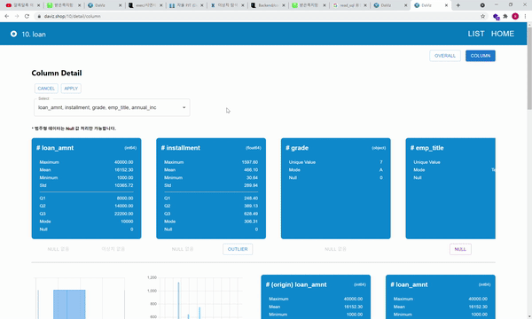

# 시연 시나리오

### 📚목차

1. [Home](#Home)
2. [Data Register](#Data Register)
3. [Data List](#Data List)
4. [Overall](#Overall)
5. [Column](#Column)

---

### 1. Home

- **데이터 검색**

  - 데이터셋 제목/설명/파일이름으로 원하는 데이터셋 검색 가능

- **데이터 목록**

  - "DATA LIST" 버튼 클릭시 [데이터 목록](#Data List) 페이지로 이동

- **데이터 등록**

  - "DATA REGIST" 버튼 클릭시 [데이터 등록](#Data Register) 팝업창 등장

  

### 2. Data Register

- **데이터 등록**

  1. "Drag and Drop"으로 데이터셋 등록
  2. 데이터셋에 대한 "제목"과 "설명" 입력
  3. "CREATE" 버튼 클릭 시 데이터셋 등록 완료 (저장 및 초기 데이터 분석 수행)

  

### 3. Data List

- **데이터 목록**

  - 각각의 데이터셋이 카드로 나열되어있음.
  - 데이터셋의 제목, 설명, 컬럼명, 레코드 개수를 확인할 수 있음.
  - 카드 클릭시 해당 데이터셋 상세 페이지로 이동

- "HOME" 버튼 클릭시 [홈](#Home) 페이지로 이동

- 데이터셋 제목/설명/파일이름으로 데이터셋 검색 가능

  

### 4. Overall

- **원본 데이터 분석 그래프**

  - 모든 컬럼의 분석 결과 그래프 확인 가능

- **원본 데이터 100개 출력**

  - 원본 데이터 100개까지 확인 가능

  

- **Overall / Column 선택**

  - Overall 페이지에서 "COLUMN" 버튼 클릭시 [컬럼 디테일](#Column) 페이지로 이동

- **원본 데이터 파일 저장**

  - "DOWNLOAD" 버튼 클릭시 원본 데이터 파일 저장 가능

  

### 5. Column

- **컬럼 선택**

  - 컬럼 목록 중 원하는 컬럼만 선택해서 확인 가능

- **선택 컬럼들 분석 결과 모아 보기**

  - 선택 컬럼들의 필터 적용 후 달라진 통계량 한 눈에 확인 가능

- **필터 적용 버튼**

  - 버튼 클릭시 각 컬럼별 결측치/이상치 제거 가능

  

- **해당 컬럼 필터 적용 후 그래프**

  - 선택 컬럼들별로 필터 적용 후 그래프 확인 가능
    - 수치형 - 박스플롯(box plot), 히스토그램(histogram)
    - 범주형 - 도넛차트(doughnut chart), 막대그래프(bar chart)

- **해당 컬럼 필터 적용 전/후 비교**

  - 선택 컬럼들별로 필터 적용 전/후 통계량 비교 가능

  