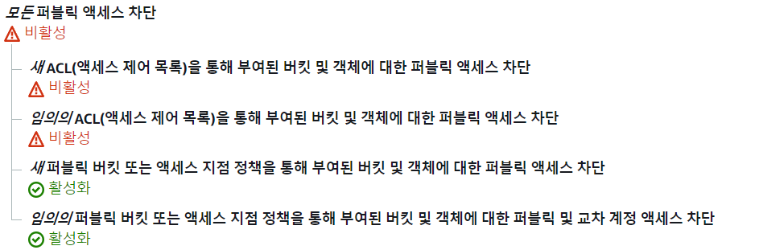

# S3 연결하기

참고 블로그

- [버킷생성](https://bamdule.tistory.com/177)
- [Django와 S3 연결하기](https://richone.tistory.com/7)
- https://bamdule.tistory.com/177

## 목차

1) [S3 버킷 생성]()

2) [Django 연결]()


## 1. S3 버킷 생성

- name 

  - 편한대로 지정
  - daviz-bucket

- 퍼블릭 엑세스 (추후 변경 가능)

  

  - default : 모든 엑세스 차단
    - 상위 두 개 체크 해제

- 부가 옵션 

  - default 값으로 진행

- 생성

- 이후 권한 설정

  - 버킷 정책

    - 객체에 대한 엑세스 허용 

    ```
    {
        "Version": "2012-10-17",
        "Id": "Policy1635487891796",
        "Statement": [
            {
                "Sid": "Stmt1635487890836",
                "Effect": "Allow",
                "Principal": "*",
                "Action": "s3:*",
                "Resource": [
                    "arn:aws:s3:::daviz-bucket",
                    "arn:aws:s3:::daviz-bucket/*"
                ]
            }
        ]
    }
    ```

  - CORS 정책 (x)

- IAM 설정

  - 퍼블릭 엑세스를 위해 
  - IAM - 사용자 추가 - 역할 - S3FullAccess 권한 추가 - 생성
  - 생성 단계에서 csv 파일 저장 (id, key 존재)


## 2. Django와 연결

### 1) django_storage 

- S3와 Django 연결, 파일 시스템 관련 메서드를 정의해둔 패키지

- 설치

  ```
  pip install django_storages
  ```

  - `installed_apps` 추가

### 2) boto3 

- S3 통신을 위한 패키지
  - 조작 API 
  - request를 이용하여 요청 보낼 필요 없음
  - Method
    - delete
    - ...

- 설치 

  ```
  pip install boto3
  ```
  


### 3) Settings

```python
#S3 관련 설정
#ACCESS
AWS_ACCESS_KEY_ID = '{IAM 사용자 ACCESS ID}'
AWS_SECRET_ACCESS_KEY = '{IAM 사용자 ACCESS KEY}'
AWS_REGION = 'ap-northeast-2'


# #Storage
AWS_STORAGE_BUCKET_NAME = 'daviz-bucket'
AWS_S3_CUSTOM_DOMAIN = '%s.s3.%s.amazonaws.com' % (AWS_STORAGE_BUCKET_NAME,AWS_REGION)
AWS_S3_OBJECT_PARAMETERS = {
    'CacheControl': 'max-age=86400',
}
DEFAULT_FILE_STORAGE = 'storages.backends.s3boto3.S3Boto3Storage'
MEDIA_ROOT = os.path.join(BASE_DIR, 'path/to/store/my/files/')
```

- 

### 4) Model

```python
from django.db import models
from django.db.models.base import Model

# Create your models here.
class test(models.Model):
    testfield = models.CharField(max_length=200)
    dataset = models.FileField()

    def __str__(self):
        return self.testfield
```


### 5) Serializer

```python
from rest_framework import serializers
from .models import *

class DataSerializer(serializers.ModelSerializer):
    
    class Meta:
        model = test
        fields = ('__all__')

```


### 6) Views

- upload

```python
@api_view(['POST'])
def upload(request, format=None):
    serializers = DataSerializer(data=request.data)
    if serializers.is_valid():
        serializers.save()
        return Response(serializers.data, status=status.HTTP_201_CREATED)
```

- download

